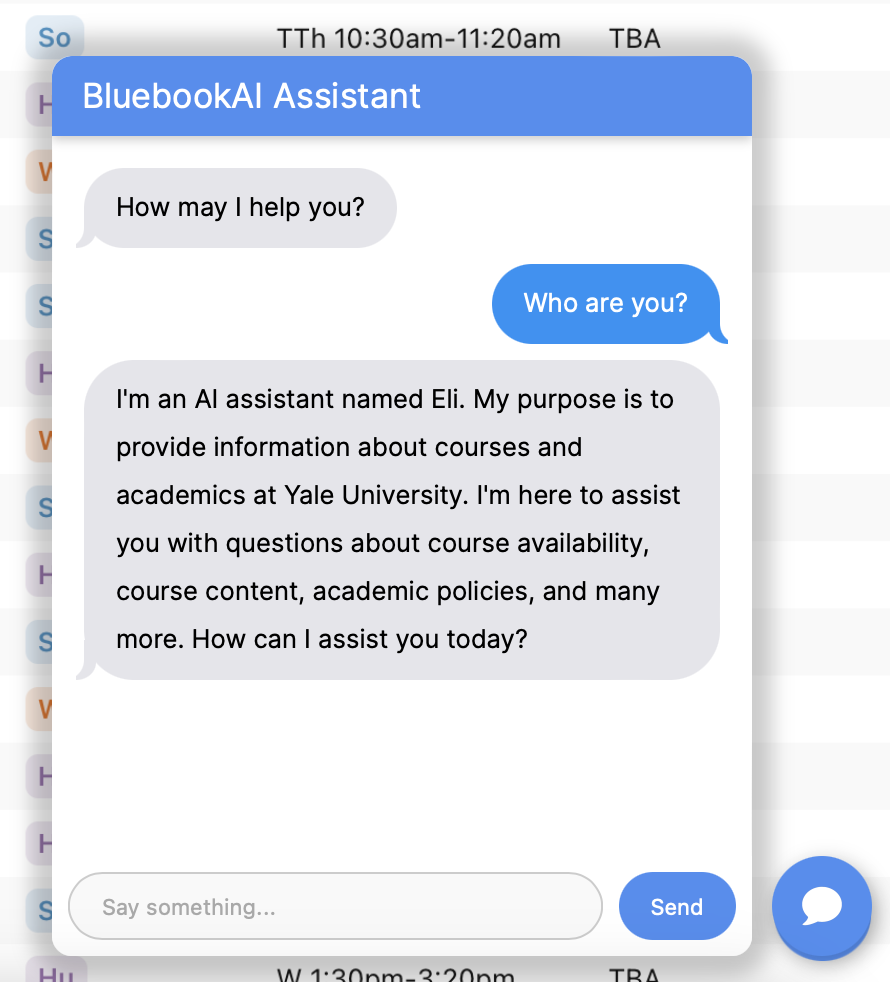

# BluebookAI

Course selections play a pivotal role in shaping student learning experiences at Yale. Each semester, Yale has a vast array of course offerings, and it is difficult for students to select specific courses that fit their needs and interests. Beyond the official Yale Course Search, students often turn to CourseTable for additional insights from other students’ reviews and experiences.

With CourseTable, students retrieve information using keyword search, filtering, and sorting across classes offered in current and previous semesters. However, CourseTable currently uses exact match only, which can be less helpful when the student doesn’t know what specific course(s) they are searching for. For example, a student who searches for “DevOps” may not see CPSC 439/539 Software Engineering in returned search results.

In this project, we aim to enhance students’ course selection experience by augmenting CourseTable with a natural language interface that can provide customized course recommendations in response to student queries. By supplying more relevant and dynamic results and expanding students’ means of interaction with course data, this will enable students to more easily and effectively determine the best course schedule for themselves.

## Get Started

### Frontend

0. If you don't already have Node.js installed, you can download it [here](https://nodejs.org/en/download/).
1. Enter the `frontend` directory and install the dependencies:

   ```bash
   cd frontend
   npm install
   ```

2. Start the Next.js app:

   ```bash
   npm run dev
   ```

### Backend

1. Enter the `backend` directory, create a virtual environment, activate it, and install the dependencies. Make sure you have Python 3.10+ installed.

   ```bash
   cd backend
   python -m venv bluebook_env
   source bluebook_env/bin/activate
   pip install -r requirements.txt
   ```

2. You will also need to create `.env` in the the `backend` directory that contains your API key to OpenAI and the MongoDB URI. The `.env` file should look like this:

```
MONGO_URI="mongodb+srv://xxx"
OPENAI_API_KEY="sk-xxx"
```

Don't push your API key to this repo!

To run sentiment classification, first create a conda environment for Python 3 using the `backend/sentiment_classif_requirements.txt` file:

```bash
cd backend
conda create --name <env_name> --file sentiment_classif_requirements.txt
```

Activate the conda environment by running:

```
conda activate <env_name>
```

where `<env_name>` is your name of choice for the conda environment.

You can get an OpenAI API key [here](https://platform.openai.com/api-keys). The MongoDB URI is shared by the team. You will need to have your IP address allowlisted by MongoDB to query the database. Contact the team for access.

3. Start the Flask server:

   ```bash
   python app.py
   ```

## Usage

1. Enter the `frontend` directory and run

```bash
npm run dev
```

2. Enter the `backend` directory and run

```bash
python app.py
```

3. Ask away!



4. You can also use your favorite API client (e.g., Postman) to send a POST request to `http://localhost:8000/api/chat` with the following JSON payload:

   ```json
   {
     "role": "user",
     "content": "Tell me some courses about personal finance"
   }
   ```

   You should receive a response with the recommended courses like this:

   ```json
   {
       "courses": [
           {
               "course_code": "ECON 436",
               "description": "How much should I be saving at age 35? How much of my portfolio should be invested in stocks at age 50? Which mortgage should I choose, and when should I refinance it? How much can I afford to spend per year in retirement? This course covers prescriptive models of personal saving, asset allocation, borrowing, and spending. The course is designed to answer questions facing anybody who manages their own money or is a manager in an organization that is trying to help clients manage their money.",
               "title": "Personal Finance"
           },
           ...
       ],
       "response": "To learn more about personal finance, you can start by taking courses or workshops that focus on financial management, budgeting, investing, and retirement planning. Some universities and educational platforms offer online courses on personal finance, such as ECON 436: Personal Finance and ECON 361: Corporate Finance. Additionally, you can explore resources like books, podcasts, and websites dedicated to personal finance advice and tips. It may also be helpful to consult with a financial advisor or planner for personalized guidance on managing your finances effectively."
   }
   ```
